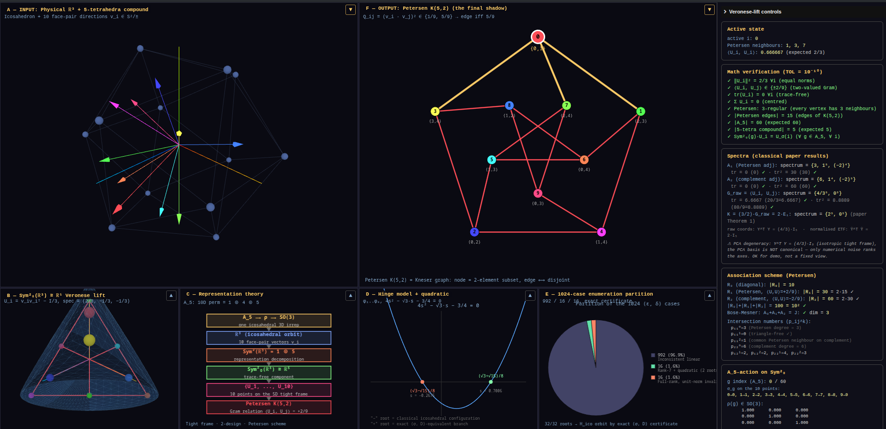

# Veronese Descent Rigidity of the Petersen ETF



Manuscript, exact algebraic certificates, and reproduction logs for the paper
**"Veronese Descent Rigidity of the Petersen Equiangular Tight Frame"**.

The paper proves that the unique 10-line equiangular tight frame in $\mathbb{R}^5$
admits, up to $O(3) \times S_5$, a unique Veronese-image realisation
$\nu_2(\mathbb{RP}^2) \subset \mathrm{Sym}^2_0(\mathbb{R}^3) \cong \mathbb{R}^5$.
The proof combines a representation-theoretic descent argument (Schur's lemma
on $A_5$ plus a spectral obstruction on the Veronese surface) with an exact
computer-assisted certificate for the rigidity of the classical compound of
five tetrahedra. As a corollary we obtain the **Signed Gram Rigidity
Theorem**.

## Repository layout

```
veronese-descent-rigidity/
├── paper/
│   ├── main.md              # Manuscript source (Markdown + LaTeX math)
│   ├── main.tex             # Generated from main.md by build.sh
│   ├── main.pdf             # Compiled PDF
│   ├── references.bib       # Bibliography (12 entries)
│   └── figures/             # Paper figures (PDF + PNG)
├── supplement/
│   ├── supplement.md        # Reproducibility manifest (auditor-facing)
│   └── logs/                # Verbatim run logs for every script + figure
├── scripts/
│   ├── *.py                 # Certificate scripts referenced in §8
│   └── figures/*.py         # Python sources for paper/figures/
├── viz/
│   └── veronese.html        # Interactive 6-panel visualisation (Three.js)
├── README.md                # This file
├── requirements.txt         # Python dependencies
├── LICENSE                  # MIT for code, CC BY 4.0 for paper (see LICENSE-CC-BY-4.0)
├── LICENSE-CC-BY-4.0
├── CITATION.cff
├── MANIFEST.sha256          # SHA-256 hashes of every artefact
├── build.sh                 # End-to-end build: md → tex → pdf + manifest
└── .gitignore
```

## Reproducing the certificates

```bash
python3 -m venv .venv
source .venv/bin/activate
pip install -r requirements.txt
```

**Algebraic certificates** (Theorems 5.4 and 5.5):

```bash
python3 scripts/five_tet_hinge_exact.py
python3 scripts/five_tet_hinge_enum.py
python3 scripts/five_tet_orbit_exact.py
```

**Independent numerical checks** (Theorem 1, Lemmas 3.1, 4.2, 5.1):

```bash
python3 scripts/verify_idempotent_kernel.py
python3 scripts/p5_jordan_descent.py
```

**Re-rendering the paper figures**:

```bash
python3 scripts/figures/fig1_proof_cascade.py
python3 scripts/figures/fig2_petersen_scheme.py
python3 scripts/figures/fig3_schur_obstruction.py
python3 scripts/figures/fig4_hinge_bridge.py
```

See `supplement/supplement.md` (§A.2) for the full script-to-theorem mapping,
expected outputs (§A.4), and the runtime table (§A.6).

## Building the PDF from source

The single source of truth is `paper/references.bib` (bibliography) and
`paper/main.md` (manuscript body before the `## References` heading).
To regenerate everything — Markdown reference list, `main.tex`,
`main.pdf`, and the repository-root `MANIFEST.sha256`:

```bash
./build.sh
```

The script (run from the repository root):

1. Regenerates the `## References` section of `main.md` from `references.bib`.
2. Runs Pandoc (`main.md` → `main.tex`).
3. Applies small LaTeX-only patches (resizebox for the §1.1 cascade,
   `\path{}` + `\small` for the §8.2 table).
4. Compiles with `pdflatex` twice and reports any overfull boxes.
5. Refreshes `MANIFEST.sha256` over every user-visible artefact.

Requirements:

- `pandoc >= 3.0`
- A TeX Live install with `pdflatex`, `amsmath`, `amssymb`, `graphicx`,
  `longtable`, `booktabs`, `url`, `hyperref` (e.g. `texlive-scheme-medium`
  on Fedora).

If you only need to view the rendered manuscript without rebuilding, open
`paper/main.pdf` directly, or read `paper/main.md` on GitHub (the math
renders via KaTeX).

## Verifying artefact integrity

```bash
sha256sum -c MANIFEST.sha256
```

## Viewing the interactive visualisation

Open `viz/veronese.html` in a modern browser. Three.js and lil-gui are loaded
from a CDN, so an internet connection is required on first load.

## Citing

The executable certificates and reproducibility material are archived at
Zenodo with DOI [10.5281/zenodo.20258339](https://doi.org/10.5281/zenodo.20258339).
Citation metadata is in `CITATION.cff`.

## License

- Python source files in `scripts/` and `scripts/figures/`: **MIT**
  (see `LICENSE`).
- Manuscript (`paper/main.md`, `supplement/supplement.md`) and generated
  figures in `paper/figures/`: **CC BY 4.0** (see `LICENSE-CC-BY-4.0`).
